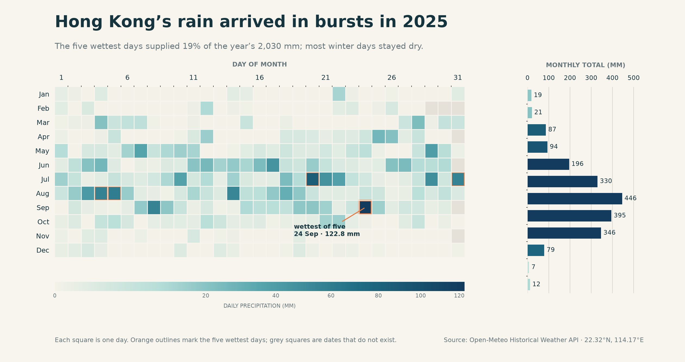

# Hong Kong Rainfall, 2025



## The phenomenon

Rainfall in Hong Kong is strongly seasonal, but an annual total alone cannot show whether the water arrived steadily or in a few intense events. This project looks at daily precipitation during 2025 and asks a simple question: how was the year’s rain distributed across individual days and months?

## The source

The raw data comes from the [Open-Meteo Historical Weather API](https://open-meteo.com/en/docs/historical-weather-api) for the coordinates 22.3193°N, 114.1694°E. Open-Meteo describes this historical product as reanalysis: it combines observations with weather models to estimate conditions on a regular grid.

The committed JSON response contains 365 dates and 365 daily precipitation totals. Each date-value pair represents one local calendar day, and the precipitation unit is millimetres. `fetch.py` makes one request and saves the unchanged response in `data/`; `plot.py` reads only that cached file.

## What the picture shows

Each heatmap square represents one day, arranged by month and day of month. Darker blue means more rain, while the bars on the right compare monthly totals. Orange outlines mark the five wettest days, and the annotation identifies the wettest of those five.

Rain was concentrated in summer and early autumn. July had the highest monthly total, at approximately 446 mm. The wettest day was 24 September, with 122.8 mm of rain. The five wettest days together contributed 18.7% of the annual total of 2,030.2 mm.

This transformation hides hourly timing and differences between districts: one daily value at one coordinate cannot show when rain fell during the day or how a storm varied across Hong Kong. The nonlinear colour scale also makes light rain visible, but it compresses the visual difference between the largest values; the monthly bars retain their linear scale.

## Run it

```text
uv run fetch.py
uv run plot.py
```

